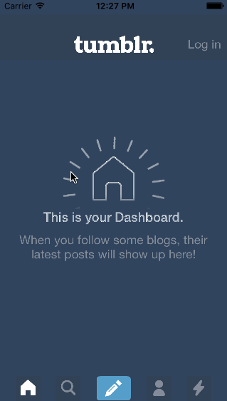

# tumblr
CodePath Week 4 Assignment

The purpose of this assignment is to leverage animations and gestures to create custom navigation.

Time spent: 10 hours

#Project Requirements

 - Tapping on Home, Search, Account, or Trending should show the respective screen and highlight the tab bar button
 - Compose button modally presents the compose screen with animation of compose buttons
 - Login button modally presents login screen
 - Trending has a scroll view to show entire content

#Demo GIF

#License
Licensed under the Apache License, Version 2.0 (the "License"); you may not use this file except in compliance with the License.

You may obtain a copy of the License at: http://www.apache.org/licenses/LICENSE-2.0

Unless required by applicable law or agreed to in writing, software distributed under the License is distributed on an "AS IS" BASIS, WITHOUT WARRANTIES OR CONDITIONS OF ANY KIND, either express or implied.

